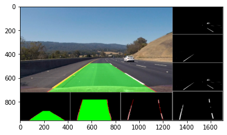

# Steps To Run The Code:

1. clone the repo
2. change the mode of the **file.sh** to Execute by:  
	`chmod +x file.sh`
3. Run the **file.sh** using:
	`sh file.sh -d <0 or 1> -i <Path of the input video>` or  
	`./file.sh -d <0 or 1> -i <Path of the input video>`
4. The output video will be found in the same directory with name **output.mp4**

# Debug mode:

if the dubug <-d> is 0 then that's mean the output video will be in the format:
	
if the dubug <-d> is 1 then that's mean the output video will be in the format:
	
	
	
# Dependencies and how to install it:

1. numpy, to install:  
	`pip install numpy`
2. opencv, to install:  
	`pip install opencv-python`
3. matplotlib, to install:  
	`pip install matplotlib`
4. moviepy, to install:  
	`pip install moviepy`

# Pipeline of the code:  

1. Thresholding:
	
		
2. Prespective Transform:
	
	
3. Lanes Detection:
	
	
4. Return to Actual Scale:
	
	
5. Add lane marks to actual image:
	
	
6. Debug Mode:
	
	
7. Process on video
